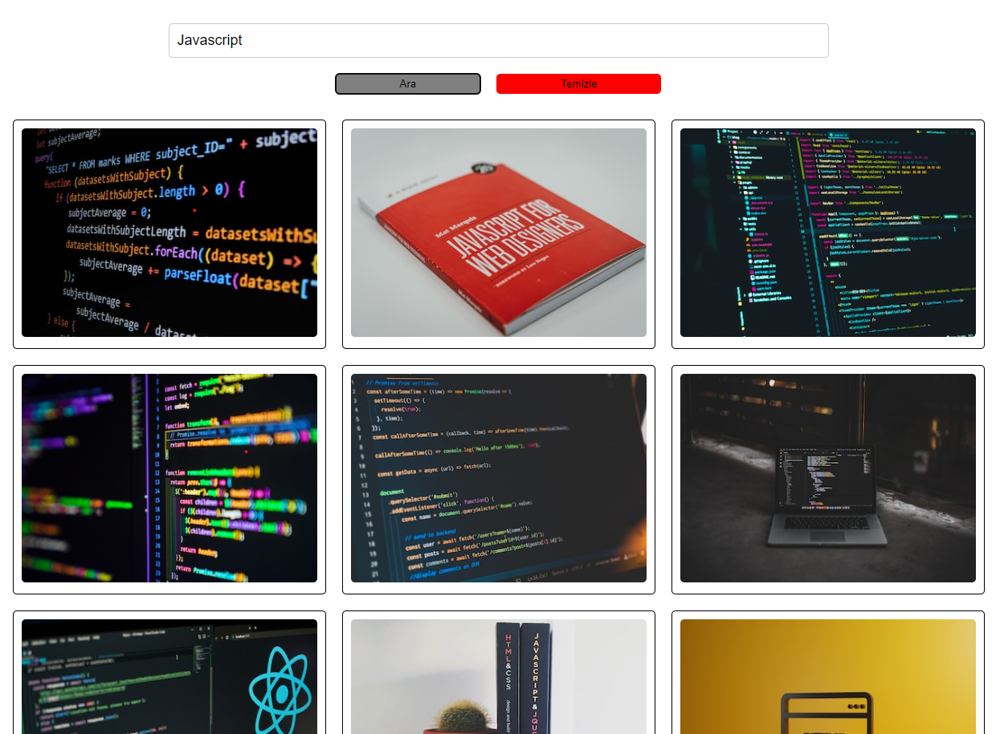

# Kod Örneği: Unsplash API ile Resim Arama

Bu basit web uygulaması, Unsplash API'ini kullanarak arama yapılan bir kelimeye göre resimleri görsel olarak görüntüler.

## Kurulum

1. Bu projeyi kendi bilgisayarınıza klonlayın veya indirin.
2. `index.html` dosyasını açarak uygulamayı çalıştırın.

## Nasıl Kullanılır

1. Arama kutusuna bir anahtar kelime girin ve "Ara" düğmesine tıklayın.
2. Arama sonuçları, resim kartları şeklinde alt kısımda görüntülenecektir.
3. Tekrar arama yapmak için "Temizle" düğmesine tıklayarak arama sonuçlarını temizleyebilirsiniz.

## Teknolojiler ve Kütüphaneler

- HTML
- CSS
- JavaScript
- Unsplash API

## Ekran Görüntüsü

---